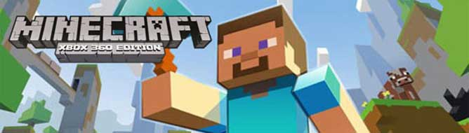

# LegacyRecomp

**Minecraft: Xbox 360 Edition — Native Recompilation Project**

  

LegacyRecomp is an independent reverse-engineering and recompilation project focused on **Minecraft: Xbox 360 Edition**.

The goal of LegacyRecomp is to recompile the original Xbox 360 executable into native code for modern platforms while preserving the original game's behavior and functionality.

## About

Minecraft: Xbox 360 Edition is part of the Legacy Console Edition family of Minecraft releases.

LegacyRecomp focuses on the original Xbox 360 version and its executable, using reverse engineering and static recompilation techniques to transform the original code into a native application.

This project is not a recreation of Minecraft from scratch. Instead, the objective is to preserve the original game's code and behavior through recompilation and compatibility layers.

## Recompilation

The general concept behind LegacyRecomp is:

    Xbox 360 Executable
            |
            v
       Binary Analysis
            |
            v
     PowerPC Code
            |
            v
    Static Recompilation
            |
            v
      Native Code
            |
            v
     Native Platform

The original Xbox 360 executable contains PowerPC code designed for the Xenon processor.

LegacyRecomp analyzes this code and converts it into native code that can run outside of the original Xbox 360 environment.

## Goals

- Recompile Minecraft: Xbox 360 Edition.
- Preserve the original gameplay and mechanics.
- Preserve the original game logic.
- Recreate required Xbox 360 functionality.
- Provide native platform support.
- Maintain compatibility with the original game's data where possible.
- Keep the project organized and maintainable.
- Document research and discoveries related to the original executable.

## Xbox 360

Minecraft: Xbox 360 Edition was designed specifically for the Xbox 360 hardware and software environment.

The original game therefore relies on functionality provided by the Xbox 360 platform.

LegacyRecomp may need to recreate or replace functionality related to:

- Xenon PowerPC execution
- Memory management
- Threads
- Synchronization
- File I/O
- Graphics
- Audio
- Controller input
- Networking
- Timers
- System services
- Xbox 360-specific libraries

The purpose of these compatibility layers is to provide the functionality expected by the original game while running on a modern platform.

## Native Platform

After recompilation, the resulting code can be adapted to the target platform through native platform implementations.

This allows platform-specific functionality to be separated from the recompiled game code.

For example:

    Recompiled Game Code
            |
            v
    Compatibility Layer
            |
            v
    Platform Abstraction
            |
            v
    Native Platform APIs

This structure allows the game logic to remain as close as possible to the original executable while platform-specific functionality is implemented separately.

## Graphics

The original Xbox 360 version uses the graphics hardware and APIs available on the Xbox 360.

A native implementation therefore requires a graphics layer capable of providing the functionality expected by the recompiled game.

This may include:

- Textures
- Vertex buffers
- Index buffers
- Render targets
- Depth buffers
- Shaders
- Rendering states
- GPU synchronization
- Presentation
- Resolution handling

The objective is to reproduce the behavior of the original rendering system while using APIs available on the target platform.

## Audio

Audio functionality also depends on the original Xbox 360 environment.

The native implementation may provide replacements for systems responsible for:

- Sound playback
- Music
- Audio buffers
- Streaming
- Volume control
- Channels
- Audio synchronization

## Input

Minecraft: Xbox 360 Edition was designed around the Xbox 360 controller.

LegacyRecomp can provide an input abstraction capable of translating modern input devices into the input behavior expected by the game.

Potential input devices include:

- Xbox controllers
- Other gamepads
- Keyboard
- Mouse
- Platform-specific controllers

## File System

The original game expects its resources and persistent data to be accessible through the Xbox 360 environment.

A native implementation therefore requires a compatible file-system layer.

This may include handling for:

- Game resources
- Configuration files
- Save data
- World data
- Player data
- Cached files
- Other persistent information

Original copyrighted game data is not included in this repository.

## Save Data

Minecraft contains persistent player and world information.

A native implementation may need to support:

- World saves
- Player data
- Game settings
- Configuration
- Preferences
- Other persistent data

Where practical, preserving compatibility with existing formats can help maintain the original game's behavior.

## Networking

Minecraft: Xbox 360 Edition contains networking functionality designed for the Xbox 360 environment.

Networking systems may require additional compatibility work when running outside of the original console.

The implementation of networking functionality depends on the requirements of the original executable and the target platform.

## Reverse Engineering

LegacyRecomp involves analysis of compiled software and reconstruction of its behavior.

Research may include:

- PowerPC instruction analysis
- Function identification
- Control-flow analysis
- Data structure reconstruction
- Address mapping
- Memory analysis
- Runtime analysis
- Xbox 360 system research
- Platform interface analysis
- Native code generation

The project is intended to provide a technical exploration of how a large Xbox 360 application can be transformed into a native program.

## Development

Development can involve several areas of software engineering and reverse engineering, including:

- C/C++
- PowerPC
- Binary analysis
- Static recompilation
- Systems programming
- Graphics programming
- Audio programming
- Input systems
- File systems
- Networking
- Platform abstraction
- Debugging
- Performance optimization

## Original Game Files

LegacyRecomp does not distribute the original Minecraft: Xbox 360 Edition executable, game assets, or other copyrighted game data.

Required original game files must be obtained separately.

Do not commit original copyrighted game data to this repository.

## Contributing

Contributions are welcome.

Useful contributions include:

- Reverse-engineering research
- Code improvements
- Platform implementations
- Documentation
- Testing
- Bug fixes
- Build-system improvements
- Compatibility research
- Performance improvements
- Technical investigations

Please do not submit copyrighted game data or proprietary assets in pull requests.

## Legal Notice

Minecraft and Minecraft: Xbox 360 Edition are copyrighted works and trademarks of their respective owners.

LegacyRecomp is an independent fan-made project and is not affiliated with, sponsored by, or endorsed by Mojang Studios or Microsoft.

This repository does not distribute the original game's executable, assets, or other copyrighted game data.

Users are responsible for obtaining and using any required game files in accordance with applicable laws.

## License

The source code contained in this repository is provided under the license specified by the project.

Third-party components may have their own licenses. Refer to the relevant files and directories for additional licensing information.

---

**LegacyRecomp**

*Recompiling Minecraft: Xbox 360 Edition for modern platforms.*
